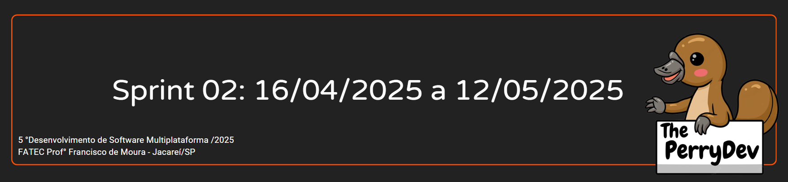
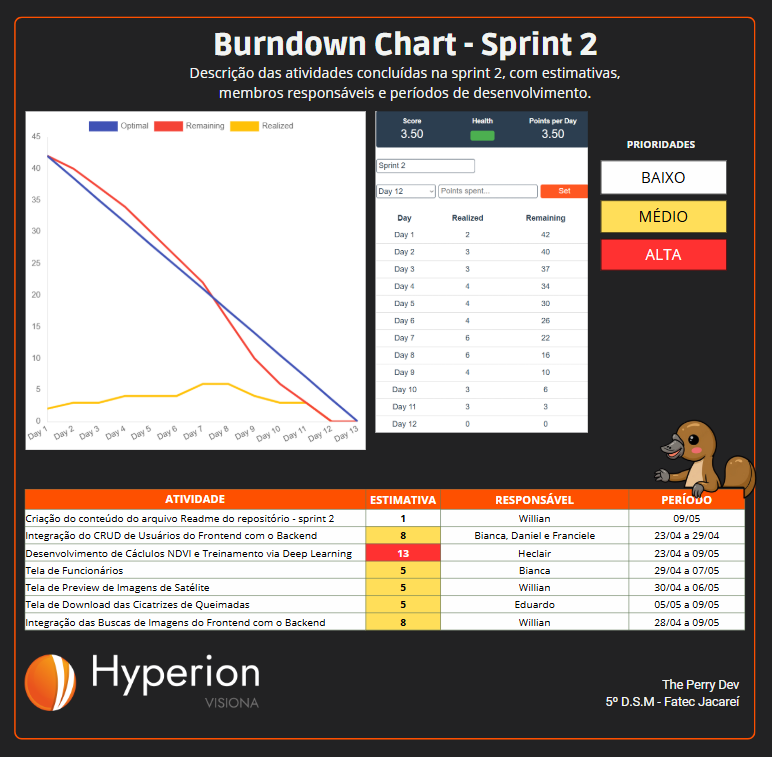

 

 

    <a href="#objetivos">Objetivos da sprint</a> &nbsp |&nbsp &nbsp
    <a href="#entregas">Entregas</a> &nbsp |&nbsp &nbsp
    <a href="#metricas">Métricas do time</a> &nbsp |&nbsp &nbsp

O projeto tem como objetivo o desenvolvimento de uma aplicação web para o mapeamento automático de cicatrizes de queimadas, utilizando imagens do sensor WFI a bordo dos satélites CBERS-4, CBERS-4A e Amazônia-1.
Na Sprint 02, os esforços se concentraram na integração entre o frontend e o backend, abrangendo:
•	A implementação do CRUD de usuários;
•	As funcionalidades de busca e processamento de imagens de satélite;
•	O desenvolvimento das interfaces para:
o	Gestão de funcionários;
o	Visualização (preview) das imagens consultadas;
o	Download dos dados processados.
Além disso, foram integrados os cálculos de NDVI e o processamento automatizado via Deep Learning, utilizando um modelo treinado de segmentação (U-Net) para identificar áreas queimadas nas imagens.

[LINK DE APRESENTAÇÃO DA SPRINT 02](https://www.youtube.com/watch?v=IOSUI0NkEHU)

## :dart: Objetivos da Sprint
Os requisitos (funcionais e não funcionais) abrangidos por essa sprint são:
- RF 01: O usuário deverá definir uma região/área e um período de interesse e obter as imagens da API do PyStac.
- RF 02: O usuário deverá obter um mapeamento automático das cicatrizes de queimadas através de Inteligência Artificial;
- RF 04: O usuário poderá exportar os dados em formatos diferentes;
- RF 05: O usuário poderá visualizar as imagens obtidas independente da cobertura de nuvens;
- RF 07: O usuário administrador poderá cadastrar novos usuários.
- RF 08: O usuário deverá usufruir da plataforma de maneira intuitiva e prática.
- RNF 09: Documentação e gerenciamento no GitHub.
- RNF 10: Processo Scrum.
- RNF 11: Back-end: Python, FastAPI e Deep Learning.
- RNF 12: Front-end: React, Leaflet, TypeScript, HTML e CSS.
- RNF 13: Armazenamento: PostgreSQL.

→ [Voltar ao topo](#topo)

        
## :heavy_check_mark: Entregas

### Integração do CRUD de Usuários com Autenticação e Criação das Telas de Funcionários

Implementado a funcionalidade de cadastro, listagem, edição e exclusão de usuários na aplicação em seus respectivos botões. Essas funcionalidades garantem o gerenciamento básico de acessos, essencial para controle de diferentes perfis no sistema.

→ [Voltar ao topo](#topo)

### Criação das Tela Preview de Imagens, Exportar Dados e de Overlay Manual

Foram implementados no frontend três painéis principais para facilitar a interação com os dados processados. O primeiro exibe cards das imagens filtradas, com visualização de thumbnails, botão para sobreposição no mapa e opção de iniciar o processamento completo da imagem. O segundo painel lista as imagens já processadas, exibindo os links individuais para download das bandas, máscara de nuvem, thumbnail e imagem segmentada, além de um botão para baixar todos os arquivos em um único pacote .zip. Por fim, foi desenvolvido um formulário para seleção manual de imagens .tif processadas, permitindo visualizar a versão .png correspondente e sobrepor a segmentação no mapa, com controles para ativar, ocultar ou encerrar a visualização.

→ [Voltar ao topo](#topo)

### Integração das Buscas de Imagens de Satélite do Frontend com o Backend

A integração entre o frontend e o backend foi implementada para permitir que as interações do usuário no mapa — como a seleção de áreas (BBOX), escolha de coleções e definição de datas — acionem diretamente os serviços da API. Essa funcionalidade viabiliza a consulta a imagens dos satélites CBERS-4, CBERS-4A e Amazônia-1 por meio da STAC API. Os dados retornados incluem informações completas como o ID da imagem, cobertura de nuvens, BBOX, links para as bandas espectrais e uma imagem de pré-visualização (thumbnail), que pode ser exibida e sobreposta no mapa interativo da aplicação.

→ [Voltar ao topo](#topo)   

### Desenvolvimento de Cálculos NDVI e Treinamento via Deep Learning
Foi desenvolvido um pipeline automatizado para calcular o NDVI (Índice de Vegetação por Diferença Normalizada) a partir das bandas 15 (vermelho) e 16 (infravermelho próximo) das imagens de satélite. O resultado inclui um arquivo raster .tif, que representa a distribuição da vegetação, e uma visualização temática em .png para uso no frontend. Em seguida, o NDVI é processado por um modelo U-Net previamente treinado, capaz de identificar padrões visuais de queimadas. A segmentação é feita por blocos (tiles) da imagem, gerando uma saída classificada em três categorias: vegetação, solo exposto e áreas queimadas.

Sendo assim, finalizamos os requisitos propostos para esta sprint.

→ [Voltar ao topo](#topo)

 
     
## :chart_with_upwards_trend: Métricas do time
Em prol de um melhor aproveitamento do tempo disponível durante a segunda sprint o time se dividiu em atividades como: desenvolvimento de cálculos NDVI e treinamento via Deep Learning, integração do CRUD de usuários do frontend com o backend, integração das buscas de imagens de satélites do frontend com o backend, criação das telas de funcionários, preview de imagens de satélite e exportar dados processados além da estruturação da equipe para gestão das horas com o gráfico burndown.
    

    

→ [Voltar ao topo](#topo)
