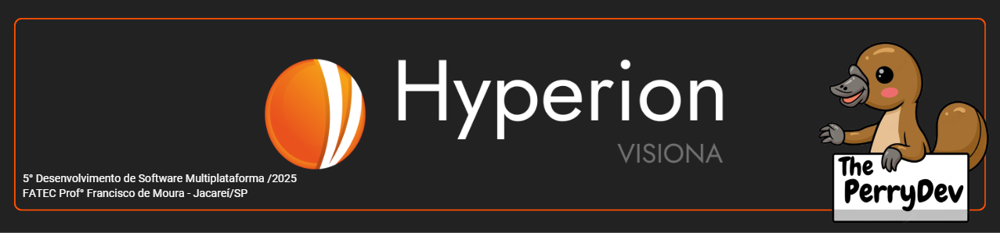
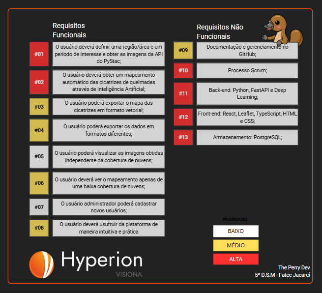
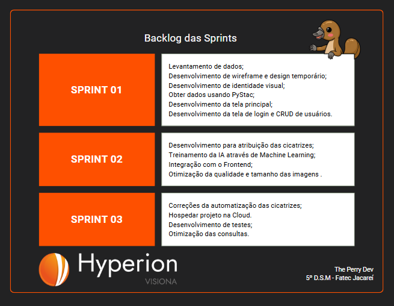
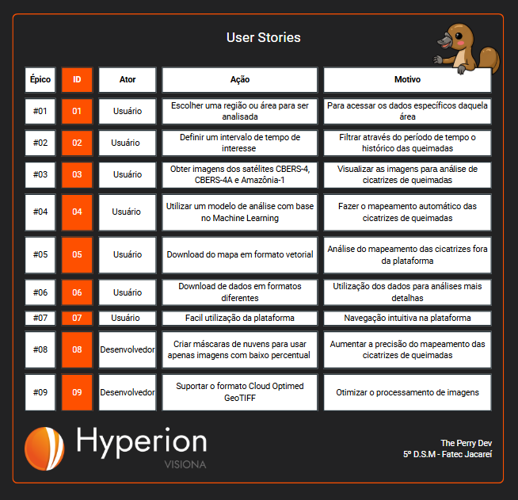

 

 

    <a href="#sobre">Sobre</a>  |  
    <a href="#backlogs">Backlog</a>  |  
    <a href="#user-stories">User Stories</a>  |    
    <a href="#tecnologias">Tecnologias</a>  |  
    <a href="#equipe">Equipe</a>  |  
    <a href="#final">Apresentação Final</a>

   

## :bookmark_tabs: Sobre o projeto

A partir da apresentação do pedido dado pela empresa Visiona, a solução apresentada pela empresa The Perry Devs consiste no desenvolvimento de aplicações web para mapeamento automático de cicatrizes de queimadas em imagens do sensor WFI a bordo dos satélites CBERS4, CBERS4A e Amazônia 1, permitindo o monitoramento de áreas afetadas por queimadas com maior eficiência e precisão na geração de dados críticos para gestores ambientais, pesquisadores e formuladores de políticas públicas.

> _Projeto baseado na metodologia ágil, utilizando o Framework SCRUM, procurando desenvolver a Proatividade, Autonomia, Colaboração e Entrega de Resultados dos envolvidos_

:pushpin: Status do Projeto: [**Em Andamento**](https://github.com/ThePerryDev/Hyperion-project) :on:

### Entregas de Sprints

Cada entrega será realizada a partir da criação de uma **tag** no repositório (Hyperion-documentation), assim como a criação de releases específicas para cada Sprint a fim de controlar cada etapa do projeto. Observe a relação a seguir:
| Sprint | Previsão | Status | Histórico | Link da Apresentação
|:------:|:----------:|:-------------|:-------------------------------------------------:|:-------------------------------------------------:|
| 01 | De 24/03/25 a 14/04/25 | :x: Não Iniciado| [Ver relatório][SPRINT 01]|
| 02 | De 16/04/25 a 12/05/25 | :x: Não Iniciado| [Ver relatório][SPRINT 02]|
| 03 | De 14/05/25 a 09/06/25 | :x: Não Iniciado| [Ver relatório][SPRINT 03]|

## :dart: Backlog 

 

 

→ [Voltar ao topo](#topo)

## :mag: User Stories

 

→ [Voltar ao topo](#topo)

## :pager: Tecnologias

Para a construção do nosso projeto, utilizamos uma variedade de linguagens, ferramentas, tecnologias e bibliotecas. Cada uma dessas escolhas foi cuidadosamente considerada para garantir a melhor implementação e atender aos requisitos do projeto. Abaixo, apresentamos as utilizadas na construção do projeto.

 

 
 	
 

→ [Voltar ao topo](#topo)

## :busts_in_silhouette: Equipe

|    Função     | Nome                                  |                                                                                                                                                      LinkedIn & GitHub                                                                                                                                                      |
| :-----------: | :------------------------------------ | :-------------------------------------------------------------------------------------------------------------------------------------------------------------------------------------------------------------------------------------------------------------------------------------------------------------------------: |
|   Scrum Master    | Luis Eduardo                     |            |
|   Product Owner   | Willian Garcia         |                 |
|   Dev Team    | Bianca Lucas                |       |
|   Dev Team    | Daniel Dornelas          |                     |
|   Dev Team    | Franciele Chesere               |   |
|   Dev Team    | Heclair Sousa               |   |

→ [Voltar ao topo](#topo)