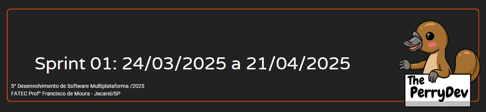
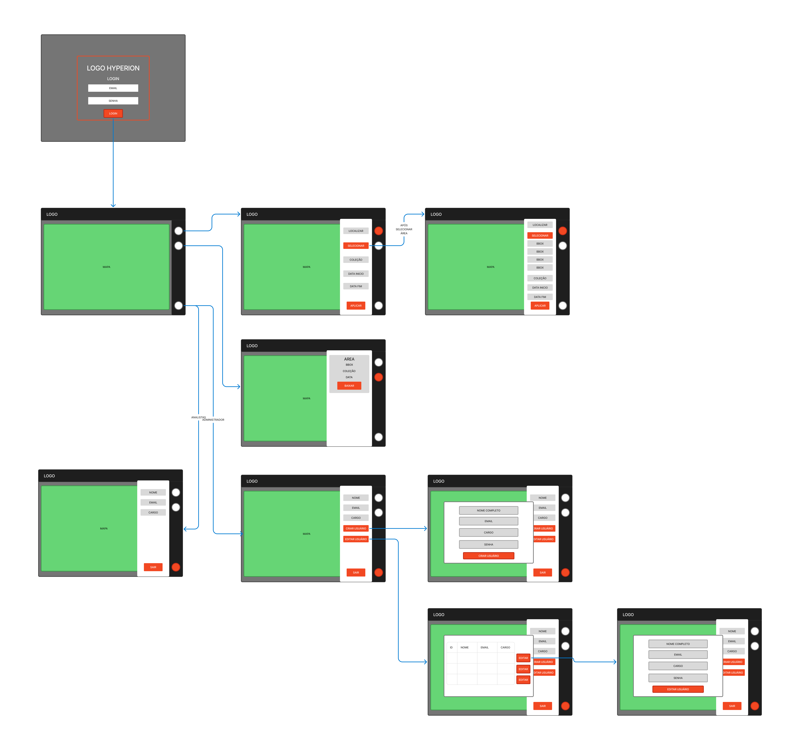
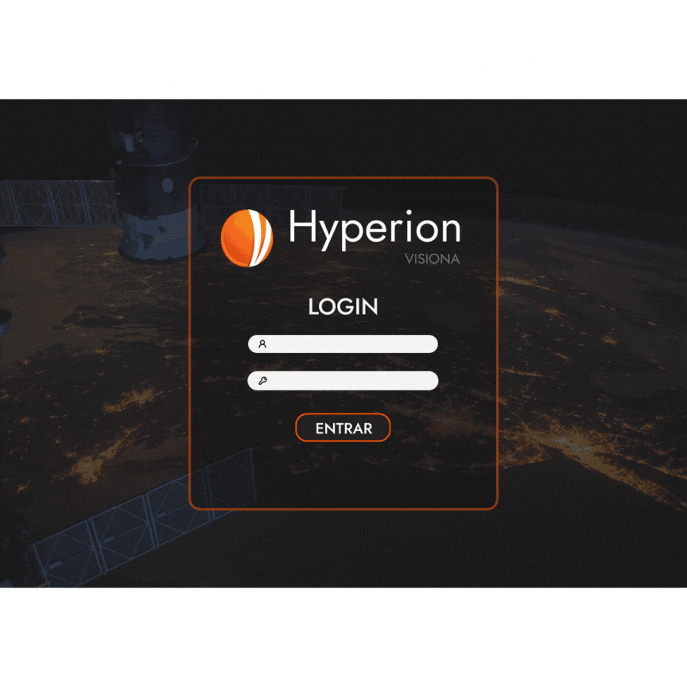
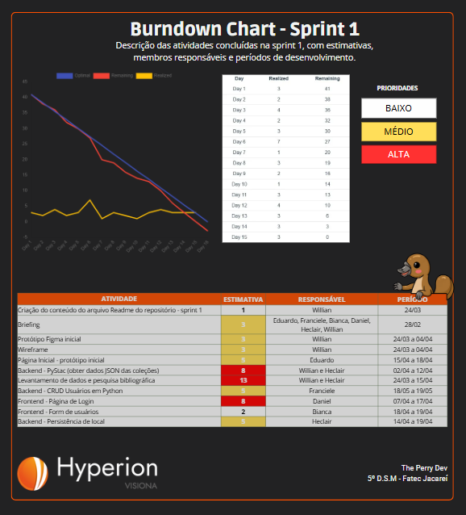

 

 

    <a href="#objetivos">Objetivos da sprint</a> &nbsp |&nbsp &nbsp
    <a href="#entregas">Entregas</a> &nbsp |&nbsp &nbsp
    <a href="#prototipo">Desenvolvimento do Protótipo</a> &nbsp |&nbsp &nbsp 
    <a href="#metricas">Métricas do time</a> &nbsp |&nbsp &nbsp

O projeto constitui na construção de uma aplicação web para mapeamento automático de cicatrizes de queimadas usando imagens do sensor WFI a bordo dos satélites CBERS4, CBERS4A e Amazônia 1. Com base nessa estruturação a sprint 01 consistiu em horas voltadas para o levantamento de dados, o desenvolvimento do wireframe, o desenvolvimento de design e identidade visual, a modelagem do banco de dados, o desenvolvimento do backend para buscar dados do PyStac e o desenvolvimento da página de login, da página principal e as abas de filtro de busca, de download das imagens e de configurações do usuário .

[LINK DE APRESENTAÇÃO DA SPRINT 01]()

## :dart: Objetivos da Sprint
Os requisitos (funcionais e não funcionais) abrangidos por essa sprint são:
- RF 01: O usuário deverá definir uma região/área e um período de interesse e obter as imagens da API do PyStac.
- RF 07: O usuário administrador poderá cadastrar novos usuários.
- RF 08: O usuário deverá usufruir da plataforma de maneira intuitiva e prática.
- RNF 09: Documentação e gerenciamento no GitHub.
- RNF 10: Processo Scrum.
- RNF 11: Back-end: Python, FastAPI e Deep Learning.
- RNF 12: Front-end: React, Leaflet, TypeScript, HTML e CSS.
- RNF 13: Armazenamento: PostgreSQL.

→ [Voltar ao topo](#topo)

        
## :heavy_check_mark: Entregas

### Levantamento de requisitos

O levantamento de requisitos desse projeto foi realizado através de pesquisas de mercado, onde todos do grupo se juntaram para dar ideias de como contruir nosso produto, a partir disso criou-se o User Stories e classificando-os em requisitos funcionais e não funcionais (tabelas todas se encontram no tópico [**Backlogs**](#backlogs) do readme principal deste repositório). Além da organização dos requisitos em cada sprint, gerando o Sprint Backlog.

→ [Voltar ao topo](#topo)

### Modelagem do Banco de Dados

A partir do levantamento de requisitos, foi criado uma modelagem do banco de dados para que facilite no momento da implementação do nosso projeto.

→ [Voltar ao topo](#topo)

### Elaboração do wireframe(identidade visual e design do sistema)

Como proposta para solucionar o projeto requisitado de uma aplicação web para o monitoramento das cicatrizes de queimadas, foi realizado o seguinte wireframe do nosso produto:

→ [Voltar ao topo](#topo)

    

## :desktop_computer: Desenvolvimento do Protótipo
A seguir, iniciou-se o trabalho de desenvolvimento do protótipo na plataforma figma onde era possível permitir ao usuário compreender a interação que a plataforma web irá possuir entre as páginas e formato com que o mesmo será apresentado. O protótipo a seguir.
    

[Confira o protótipo navegável na plataforma FIGMA](https://www.figma.com/design/sqtAHsbGNnqJHRNCAOSQQI/Hyperion-Visiona?node-id=0-1&p=f&t=9wuaxpzianFrNiDr-0)

→ [Voltar ao topo](#topo)

### Frontend, Backend e Criação do Banco de Dados
Com toda a pesquisa inicial desenvolvida e ao wireframe proposto, foram desenvolvidas as páginas de login e página principal e suas respectivas abas do navbar para aplicar filtros de pesquisa, baixar imagens e configurar usuários, foram desenvolvidos o backend usando Python e acessando a API PyStac para obter as informações sobre os satélites e armazenar parte das informações no backend e por fim foi feito o CRUD de usuários no backend para ser armazenado no PostgreSQL.

Sendo assim, finalizamos os requisitos propostos para esta sprint.

→ [Voltar ao topo](#topo)

 
     
## :chart_with_upwards_trend: Métricas do time
Em prol de um melhor aproveitamento do tempo disponível durante a primeira sprint o time se dividiu em atividades como: planejamento, brieffing, estruturação do GitHub, criação do product backlog, sprint backlog, pesquisa e elaboração do design e da Identidade Visual, criação do wireframe e layout do site, assim como estruturação da equipe para gestão das horas com o gráfico burndown.
    

    

→ [Voltar ao topo](#topo)